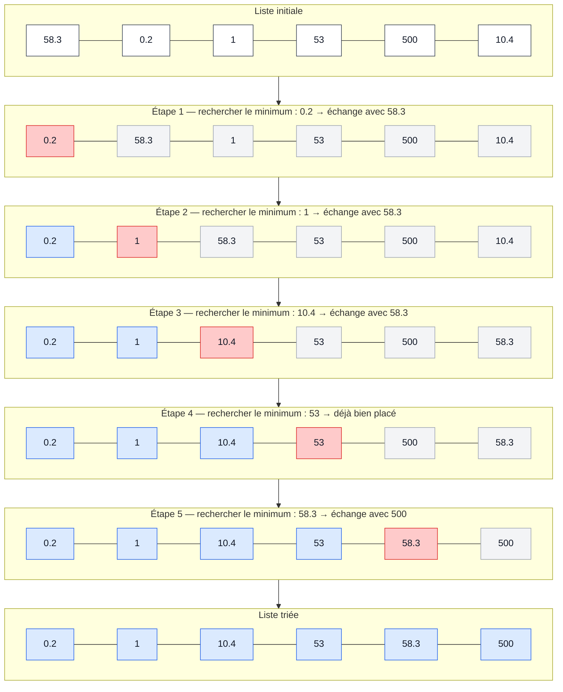
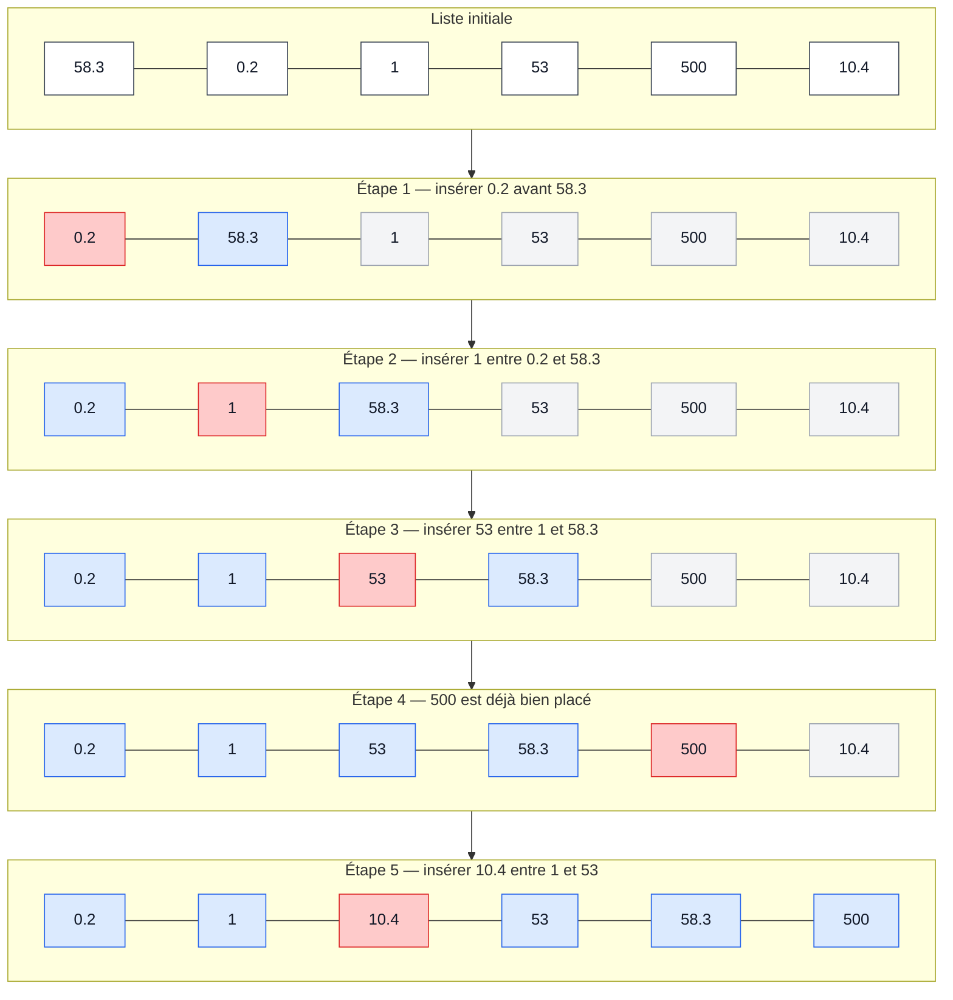

# Informatique S3 — Cours Python

# Séquence 1 — Premiers pas en Python
## 1. Bases
### 1.1 Variable, identifiant et affectation
**Définition :** Une **variable** est l'association d'un **identifiant** à un objet stocké en mémoire.
Cette opération d'association est appelée **affectation** (`=`).
Exemple : `a = 1` et `b = 2`.

> **Attention :**
> 1. (`=`) n'est pas symétrique : `1 = a` est impossible.
> 2. L'opérateur `=` permet également la mise à jour d'une variable.
            
**Exercice :** Attribuer une valeur à la variable `a` et une autre à la variable `b`.
```python
a = 1
b = 2
```
Pour inverser les deux variables :
```python
c = a
a = b
b = c
```

> **Remarque :**
> 1. Bien choisir l'identifiant des variables (`s`, `somme`, etc.).
> 2. Un identifiant doit respecter certaines règles : il ne peut pas contenir certains caractères (`@`, `#`, etc.) et ne peut pas commencer par un nombre.
            
### 1.2 Commentaire
En Python, on utilise `#` pour écrire un commentaire sur une ligne.
Un commentaire peut également être placé après du code sur la même ligne.
On peut aussi utiliser `"""` pour une chaîne de caractères multilignes. On peut parfois l'utiliser comme un commentaire, mais ce n'est pas techniquement un commentaire.

**Exemple :**
```python
# commentaire d'une ligne
a = 1  # commentaire après du code
"""
Chaîne de caractères
sur plusieurs lignes
"""
```

### 1.3 Entrée/Sortie
Affichage : `print()`

Multi-affichage:
```python
a = 1
b = 2
c = 3
print(a, b, c)
# RETOURNE : 1 2 3
```

Affichage de chaîne de caractères : `print("Hello World!")`

Saisie utilisateur : `input()`

> **Attention :** `input()` renvoie **toujours** une chaîne de caractères.

Exemple :
```python
name = input("Quel est votre nom ? ")
print(name)
```

## 2. Types et opérations
**Définition :** En Python, chaque objet possède un **type**. Il indique la nature de l'objet manipulé et les **opérations** que l'on peut lui appliquer.

Fonction `type()`:
```python
print(type("Hello World"))
# RETOURNE : str
```

### 2.1 Nombres

- `int`: entier relatif
- `float`: nombres décimaux
- `complex`: nombre complexe, avec `j` pour représenter la partie imaginaire (identique au i en maths)

Exemple :
```python
z= 3+4j
print(z.real, z.imag)
```

Opérations arithmétiques:
```
+ addition
- soustraction
* multiplication
** puissance
/ division
// division euclidienne
% modulo (reste de la division euclidienne)
```

**Exercice :**
```python
a, b = 21, 5
a/b -> 4.2 en float
a//b -> 4 en int
a%b -> 1 en int
```

**Opérations d'affectation :**
incrémentation, décrémentation
```
a += 1
b -= 2
```

**Exercice :** Bob a 4 notes : 10, 15, 13 et 8. Calculer sa moyenne.
```python
moy = 10
moy += 15
moy += 13
moy += 8
moy /= 4
print(moy)
# RETOURNE : 11.5
```
        
### 2.2 Booléens
`bool` -> `True`, `False`

Opérations de comparaisons:
| Opérateur | Signification       |
| --------- | ------------------- |
| `==`      | égal à              |
| `<`       | inférieur à         |
| `>`       | supérieur à         |
| `<=`      | inférieur ou égal à |
| `>=`      | supérieur ou égal à |
| `!=`      | différent de        |


**Exercice :**
```
a, b = True, False
a == b  # False
a != b  # True
```
        
### 2.3 Chaînes de caractères, conversion de type et f-strings
Type d'une chaîne de caractères: 'str'
concaténation: assemblage de deux chaînes de caractères avec `+`

Exemple :
```python
txt1="Hello"
space=" "
txt2="World"
print(txt1+space+txt2)
```
La concaténation fonctionne également avec `+=`
**Exemple personnel :**
```python
txt = "Hello"
txt += " World"
```

Conversion de type : convertit une valeur dans le type souhaité.
```python
int()
float()
complex()
bool()
str()
```

Exemple :
```python
age = 20
print("J'ai "+str(age)+" ans")
```
```python
age = 20.0
print(f"J'ai {age:.0f} ans")
# RETOURNE : J'ai 20 ans
```

**Exercice :**
```python
p = float(input("Ton poids (kg)? "))
t = float(input("Ta taille (m)? "))
print(f"Ton imc est: {p/(t**2)}")
```

## 3. Débogage
### 3.1 Réflexes
- Lire l'erreur et essayer de la comprendre.
- Vérifier la syntaxe du code.
- Utiliser `help()`. [Par exemple `help(print)' renvoie la documentation sur la fonction `print()`]
- Rechercher sur Google votre message d'erreur.

### 3.2 Erreurs courantes
- `SyntaxError`: apparaît quand le code est mal écrit: oubli de parenthèse, de tabulation, de frappe dans le code (print("Hello Wolrd") n'est pas une erreur), ...
- `NameError`: apparaît par exemple quand une variable n'est pas définie, ...

# Séquence 2 — Logique, tests conditionnels et boucles
## 1. Logique
### 1.1 Conditions logiques
```python
cond_1 = 5**2 < 2**5
cond_2 = 36 ==89
print(cond_1, cond_2)
# RETOURNE : True False
```
**Exercice :** Demander l'année de naissance de l'utilisateur et déterminer s'il est majeur (`True`) ou non (`False`).
```python
a=int(input("Année de naissance: "))
calc=2026-a #Pour l'année 2026
cond=calc>=18
print(f"Majeur? {cond}")
```

### 1.2 Opérateurs logiques
| Opérateur | Signification | Exemple   |
| --------- | ------------- | --------- |
| `and`     | ET            | `p and q` |
| `or`      | OU            | `p or q`  |
| `not`     | NON           | `not p`   |

```python
cond=(56>8)and(6!=9)
print(cond)
# RETOURNE : True
```

**Exercice :** Donner la génération de la personne en fonction de son année de naissance.
```python
a=int(input("Année de naissance: "))
cond1=a>=1965 and a<=1980
cond2=a>=1981 and a<=1996
cond3=a>=1997 and a<=2010
print(f"genX? {cond1}\ngenY? {cond2}\ngenZ? {cond3}")
```

## 2. Tests conditionnels
> **Remarque :**
> - Le séparateur `:` est placé après la condition.
> - L'indentation indique les actions à effectuer lorsque la condition est vérifiée.

### 2.1 Instruction if
```python
if condition:
    instructions
```

**Exercice :** Re-test de majorité
```python
age=2026-int(input("Année de naissance: "))
if age<18:
    print("Mineur")
if age>=18:
    print("Majeur")
```
 
### 2.2 Instruction if-else
```python
if condition:
    action_1
else:
    action_2
```
 
**Exercice :** paire ou impaire
```python
number=int(input("Choisir un nombre: "))
if number%2==0:
    print(f"Le nombre {number} est pair")
else:
    print(f"Le nombre {number} est impair")
```

### 2.3 Instruction if-elif-else
```python
if condition:
    action_1
elif condition_2:
    action_2
# ... autant de blocs elif que nécessaire
else:
    action_n
```

**Exercice :** Test de divisibilité de 2 à 7 d'un nombre entier choisi par l'utilisateur
```python
nombre=int(input("Choisir un nombre entier: "))
if nombre%2==0:
    print(f"{nombre} est divisible par 2")
elif nombre%3==0:
    print(f"{nombre} est divisible par 3")
elif nombre%5==0:
    print(f"{nombre} est divisible par 5")
elif nombre%7==0:
    print(f"{nombre} est divisible par 7")
else:
    print(f"{nombre} n'est pas divisible par 2, 3, 5, 7")
```
> **Note personnelle :** si on choisit `6` on remarque que le programme affiche uniquement que `6 est divisible par 2` et non par 3. En effet quand le programme trouve une condition qui est vérifiée, il ne vérifie pas les autres. Autrement dit pour 6 il s'arrête à divisible par 2. Pour cela il faudrait utiliser des `if` a la place des `elif` pour vérifier chaque condition. Il faudrait aussi remplacer/supprimer le `else` car il se trouverait à la fin de la dernière boucle.

### 2.4 Instruction match-case
Similaire à `if`-`elif`-`else`. On sort de la boucle dès qu'une condition est remplie.
```python
match element:
    case valeur_1:
        action_1
    case valeur_2:
        action_2
    # ... autant de blocs case que nécessaire 
```

Exemple :
```python
x=2
match x:
    case 1:
        print("x vaut 1")
    case 2:
        print("x vaut 2")
# RETOURNE : x vaut 2
```
Pour tester des conditions avec des opérateurs de comparaison, la syntaxe change légèrement et il faut utiliser un `if`.
```python
case x if x < 2:
```
On peut aussi utiliser `case _:` qui agit un peu comme le `else` (Ajout personnel)


**Exercice :** Programme qui demande quelle opération est associée au symbole `** en Python.
```python
print("Dans le langage Python, quelle opération est associée au symbole **?\nA. division\nB. multiplication\nC. puissance\nD. division euclidienne\n")
rep=input("Saisir la lettre de votre réponse: ")
match rep:
    case "A":
        print("FAUX")
    case "B":
        print("FAUX")
    case "C":
        print("TU AS TROUVÉ LA BONNE REPONSE")
    case "D":
        print("FAUX")
```

## 3. Boucles
- `for`: parcourt les éléments d'un itérable.
- `while`: répète des instructions tant qu'une condition est vraie.

### 3.1 Boucle `for`
```python
for element in iterable:
    Instruction
```

Exemple :
```python
for i in range(4):
    print(i)
```
`range(n)`: entier de 0 à n-1 - `range(m, n)`: entier de m à n-1
`range(m, n, p)`: on va de l'entier `m` à n-1 avec un pas de `p` (Ajout personnel)

**Exercice :** Somme de 1 à 2026 de k/2 et Produit de 1 à 20 de k^2
```python
somme=0
for i in range(1,2027):
    somme+=(i/2)
print(somme)
# RETOURNE : 1026675.5
```
et
```python
prod=1
for i in range(1,21):
    prod*=i**2
print(prod)
# RETOURNE : 5919012181389927685417441689600000000
```

On peut également parcourir directement une liste :
```python
for i in [1,2,3]:
    print(i)
# RETOURNE :
# 1
# 2
# 3
```
```python
for c in "hello":
    print(c)
# RETOURNE :
# h
# e
# l
# l
# o
```
Ajout personnel: on peut aussi parcourir deux listes (ou plus) à la fois avec `zip`:
```python
for i, j in zip(liste1, liste2):
``` 

### 3.2 Boucle while
```python
while condition:
    instruction
```

Exemple :
```python
i=0
while i < 4:
    print(i)
    i += 1
``` 
> **Attention :** il faut veiller à ce que la condition finisse par devenir fausse afin d'éviter une boucle infinie. (Ajout personnel)
> `break` permet de quitter une boucle. (Ajout personnel)

**Exercice :** Calcul du PGCD
```python
dividende=int(input("Saisir un dividende: "))
diviseur=int(input("Saisir un diviseur: "))
a=dividende
b=diviseur
r=dividende
while r != 0:
    r = a % b
    a = b
    b = r

print(f"{a} est le PGCD")
```

# Séquence 3 — Listes

## 1. Création d'une liste
```python
L=[1,2,3,4]
print(L)
# RETOURNE : [1,2,3,4]
```
ou
```python
L=["Hello",25,True,0]
```

Les listes possèdent leur propre type : `list`.
La fonction de conversion associée est `list()`.
```python
L=list("Hello")
print(L)
# RETOURNE : ['H', 'e', 'l', 'l', 'o']
```

```python
print(list(range(5)))
# RETOURNE : [0,1,2,3,4]
```

Compréhension de liste (Écriture par compression dans le cours)
```python
L=[i for i in range(5)]
print(L)
```
Une compréhension de liste permet de créer une liste à partir d'un itérable. 

**Génération de nombres aléatoires :**
En Python, on utilise la librairie `random`
Pour utiliser le module `random` :
```python
import random
```
`random.randint(m, n)` renvoie un entier aléatoire compris entre `m` et `n`, bornes incluses.

**Exercice :** Générer et afficher une liste de 20 entiers aléatoires compris entre 0 et 10.
```python
import random
liste=[random.randint(0,10) for i in range(20)]
print(liste)
```
*Correction personnelle avec des notions non vues en cours :*
```python
import random
liste=[]
for i in range(20):
    liste.append(random.randint(0,10))
print(liste)
```

### 1.1 Parcours d'une liste
Taille d'une liste : `len()`

Pour la liste `[12, 32, 76, 98, 15]` :

- `12` → indice `0`
- `32` → indice `1`
- `76` → indice `2`
- `98` → indice `3`
- `15` → indice `4`

Mais il est également possible d'utiliser des indices négatifs :

- `15` → indice `-1`
- `98` → indice `-2`
- `76` → indice `-3`
- `32` → indice `-4`
- `12` → indice `-5`

`L[i]` permet d'accéder à l'élément d'indice `i` de la liste `L`.

```python
L=[12,32,76,98,15]
print(L[1],L[-4])
# RETOURNE : 32, 32
```

> **Attention :**
> 1. Un élément ≠ un indice.
> 2. L'indexation croissante va de `0` à `len(L) - 1`.

**Exercice :** Demander à l'utilisateur un nombre, créer une liste allant de `0` à ce nombre, puis calculer la somme de tous les éléments de la liste.
```python
nombre=int(input("Choisir un nombre "))
liste=[]

# Ma version
"""for i in range (nombre):
    liste.append(i)
"""
#Version avec les éléments vus en cours
liste=[i for i in range(nombre)]

somme=0
for i in range (len(liste)):
    somme+=liste[i]

print(f"La somme de 0 à {nombre} est: {somme}")
```

### 1.2 Opérations sur les listes
Concaténation : `+`
```python
L1=[1, 2, 3]
L2=[1, 5, 6]
print(L1+L2)
# RETOURNE : [1,2,3,1,5,6]
```
La concaténation permet d'assembler deux listes.

Répétition d'une liste : `*`
```python
print([1]*20)
# RETOURNE : [1, 1, 1, 1, 1, 1, 1, 1, 1, 1, 1, 1, 1, 1, 1, 1, 1, 1, 1, 1]
```

Comparaison : `==`
`L1 == L2` renvoie `True` si les deux listes sont égales, sinon `False`.
*Deux listes sont égales si elles contiennent les mêmes éléments dans le même ordre.*

Copie : `L.copy()`
Exemple :
```python
L=[1, 2, 3]
M1=L
M2=L.copy()
L[0]=100
print(M1,M2)
# RETOURNE : [100, 2, 3] [1, 2, 3]
```
> - `M1 = L` : `M1` et `L` désignent la même liste.
> - `M2 = L.copy()` : `M2` est une copie de `L`.
> Ainsi, modifier `L` modifie également `M1`, mais pas `M2`.

**Exercice :** Afficher les 20 premiers termes de la suite de Fibonacci, de `F₀` à `F₁₉`, avec `Fₙ₊₂ = Fₙ₊₁ + Fₙ ∀n`.
```python
liste=[0,1]

#Ma version
"""
for i in range(2,20):
    liste.append(liste[i-1]+liste[i-2])
"""
#Version utilisant uniquement les notions vues en cours :
for n in range(18):
    liste=liste+[liste[n+1]+liste[n]]

print(liste)
# RETOURNE : [0, 1, 1, 2, 3, 5, 8, 13, 21, 34, 55, 89, 144, 233, 377, 610, 987, 1597, 2584, 4181]
```

### 1.3 Modification de listes
La modification d'un élément se fait en utilisant son indice.
```python
L=["h","e","l","l","o"]
L[1]="a"
print(L)
# RETOURNE : ['h', 'a', 'l', 'l', 'o']
```

Ajout d'éléments :
- `append(élément)` : ajoute un élément à la fin de la liste.
- `insert(indice, élément)` : ajoute un élément à l'indice indiqué.

Exemple :
```python
L=["h","e","l","l","o"]
L.append("!")
L.insert(2,"e")
print(L)
# RETOURNE : ['h', 'e', 'e', 'l', 'l', 'o', '!']
```

**Exercice :** Testeur de palindrome
```python
mot=input("Saisir un mot en minuscule: ")
# On pourrais utiliser .lower pour mettre le texte dans le même classe.
listeMot = []
for i in mot:
    listeMot.append(i) # Transformation du mot en une liste avec chaque caractère indépendant
palindrome = True

for j in range(len(mot)//2):
    if listeMot[j] != listeMot[-(j+1)]: #Comparaison des caractères : 1er avec le dernier, 2e avec l'avant-dernier, ... avec la méthode des indices croissants et décroissants
        palindrome=False
        # On pourrait rajouter un break pour sortir immédiatement de la boucle quand on sait que ce n'est pas un palindrome.

if palindrome == True:
    print(f"Le mot {mot} est un palindrome.")
else:
    print(f"Le mot {mot} n'est pas un palindrome.")
```

**Elements en plus :**
```python
L = [1, 2, 3]
sum(L)
# RETOURNE : 6
```
```python
list(range(0, 21, 2))
# RETOURNE : [0, 2, 4, 6, 8, 10, 12, 14, 16, 18, 20]
```

Enlever un élément d'une liste:
- `pop(indice)` : supprime l'élément à la fin à l'indice choisie.
- `remove(élément)` : supprime le premier élément verifier de la liste.

Exemple :
```python
L=["h","e","l","l","o"]
L.pop(2)
print(L)
# RETOURNE : ['h', 'e', 'l', 'o']
```
```python
L=["h","e","l","l","o"]
L.remove("l")
print(L)
# RETOURNE : ['h', 'e', 'l', 'o']
```

**Exercice :** Crée une liste de 1 à 100 et appliquer le crible d'Eratosthène pour enlever les éléments non premiers.
```python
Liste=[]
for i in range (101):
    Liste.append(i)

j=0
while j<len(Liste):
    if(Liste[j]%2==0 or Liste[j]%3==0 or Liste[j]%5==0 or Liste[j]%7==0 or Liste[j]%11==0):
        Liste.pop(j)
    else:
        j+=1

print(Liste)
# RETOURNE : [1, 13, 17, 19, 23, 29, 31, 37, 41, 43, 47, 53, 59, 61, 67, 71, 73, 79, 83, 89, 97]
```

### 1.4 Sous-listes et listes de listes

**Sous-liste :**
- `L[i: j]`: extrait une sous-liste de `L` entre l'indice `i` et `j-1`
- `L[:j]`: extrait une sous-liste de `L` entre l'indice 0 et `j-1`
- `L[i:]`: extrait une sous-liste de `L` entre l'indice i et `len(L)-1`

Exemple :
```python
L = [4, 6, 7, 3, 1, 8]
print(L[2:5])
# RETOURNE : [7, 3, 1]
```
```python
L = [4, 6, 7, 3, 1, 8]
print(L[:5])
# RETOURNE : [4, 6, 7, 3, 1]
```
```python
L = [4, 6, 7, 3, 1, 8]
print(L[2:])
# RETOURNE : [7, 3, 1, 8]
```
```python
L = [4, 6, 7, 3, 1, 8]
print(L[:])
# RETOURNE : [4, 6, 7, 3, 1, 8]
```

**Liste de liste :**
```python
L = [1, 2, [1, 2]]
print(L[2])
# RETOURNE : [1, 2]
```
Pour une matrice A :

$$
A =
\begin{pmatrix}
1 & 2 & 3 \\
4 & 5 & 6 \\
7 & 8 & 9
\end{pmatrix}
$$

On écrit:
```python
A=[[1,2,3],
   [4,5,6],
   [7,8,9]]
```

```python
L=[1,2,[3,4]]
print(L[2][0])
# RETOURNE: 3
```
```python
L=[1,2,[3,4]]
print(L[:2])
# RETOURNE: [1, 2]
```
```python
L=[1,2,[3,4]]
print(L[2:])
# RETOURNE : [[3, 4]]
```

## 2. Algorithmes de recherche
### 2.1 Recherche d'éléments

```python
print(5 in [6,5,4,3,2,1,0])
# RETOURNE : True
```

**Exercice :** Crée une liste aléatoire de 20 éléments entre 1 et 10 et rechercher toute les occurrence du nombre `5` en stockant leur indices:
```python
import random
Liste=[]
indice=[]
for i in range(21): Liste.append(random.randint(1,10))

for j in range(len(Liste)):
    if Liste[j]==5:
        indice.append(j)

print(Liste)
print(indice)
```

### 2.2 Recherche min-max

- `min()` affiche le minimum de la liste
- `max()` affiche le maximum de la liste

```python
L=[0.2,1,5.3,500,104,58,3]
print(min(L), max(L))
# RETOURNE : 0.2 500
```

*Sans ces fonctions :* (Ajout personnel)
```python
max=0
L=[0.2,1,5.3,500,104,58,3]
for i in range(len(L)):
    if L[i]>max:
        max=L[i]

print(max)

# RETOURNE : 500
```

## 3. Algorithmes de tri

- `sorted()`: trie une liste dans l'ordre croissant sans modifier l'ordre original
- `.sort()`: trie directement la liste original dans l'ordre croissant
- `reverse=True`: permet de trier dans l'ordre décroissant

```python
L=[4,0,12,56.8,22.1,98.12,89,127,12,400]
print(sorted(L))
print(L)
# RETOURNE : [0, 4, 12, 12, 22.1, 56.8, 89, 98.12, 127, 400]
# [4, 0, 12, 56.8, 22.1, 98.12, 89, 127, 12, 400]
```
```python
L=[4,0,12,56.8,22.1,98.12,89,127,12,400]
L.sort()
print(L)
# RETOURNE : [0, 4, 12, 12, 22.1, 56.8, 89, 98.12, 127, 400]
```
```python
L=[4,0,12,56.8,22.1,98.12,89,127,12,400]
print(sorted(L, reverse=True))
print(L)
# RETOURNE : [400, 127, 98.12, 89, 56.8, 22.1, 12, 12, 4, 0]
# [4, 0, 12, 56.8, 22.1, 98.12, 89, 127, 12, 400]
```
```python
L=[4,0,12,56.8,22.1,98.12,89,127,12,400]
L.sort(reverse=True)
print(L)
# RETOURNE : [400, 127, 98.12, 89, 56.8, 22.1, 12, 12, 4, 0]
```

- `.reverse()`: permet d'inverser le sense de la liste

```python
L=[4,0,12,56.8,22.1,98.12,89,127,12,400]
L.reverse()
print(L)
# RETOURNE : [400, 12, 127, 89, 98.12, 22.1, 56.8, 12, 0, 4]
```

### 3.1 Tri par sélection

🔵 Partie déjà triée · 🔴 Minimum sélectionné · ⚪ Partie non triée



**Principe :** on recherche le minimum dans la partie non triée, puis on l'échange avec le premier élément de cette partie.

### 3.2 Tri par insertion

🔵 Partie déjà triée · 🔴 Élément à insérer · ⚪ Partie non traitée


**Principe :** on prend l'élément suivant et on l'insère à la bonne position dans la partie déjà triée.

#<details>
<summary>Voir le déroulement du tri à bulles</summary>

```mermaid
flowchart TB

classDef normal fill:#ffffff,stroke:#374151,color:#111827;
classDef sorted fill:#dbeafe,stroke:#2563eb,color:#111827;
classDef selected fill:#fecaca,stroke:#dc2626,color:#111827;
classDef unsorted fill:#f3f4f6,stroke:#9ca3af,color:#111827;

%% =========================================================
%% LISTE INITIALE
%% =========================================================

subgraph S0["Liste initiale"]
direction LR
s0a["58.3"]:::normal --- s0b["0.2"]:::normal --- s0c["1"]:::normal --- s0d["53"]:::normal --- s0e["500"]:::normal --- s0f["10.4"]:::normal
end

%% =========================================================
%% PASSAGE 1
%% =========================================================

subgraph S1["Comparaison : 58.3 > 0.2 → échange"]
direction LR
s1a["58.3"]:::selected --- s1b["0.2"]:::selected --- s1c["1"]:::unsorted --- s1d["53"]:::unsorted --- s1e["500"]:::unsorted --- s1f["10.4"]:::unsorted
end

subgraph S2["Comparaison : 58.3 > 1 → échange"]
direction LR
s2a["0.2"]:::normal --- s2b["58.3"]:::selected --- s2c["1"]:::selected --- s2d["53"]:::unsorted --- s2e["500"]:::unsorted --- s2f["10.4"]:::unsorted
end

subgraph S3["Comparaison : 58.3 > 53 → échange"]
direction LR
s3a["0.2"]:::normal --- s3b["1"]:::normal --- s3c["58.3"]:::selected --- s3d["53"]:::selected --- s3e["500"]:::unsorted --- s3f["10.4"]:::unsorted
end

subgraph S4["Comparaison : 58.3 < 500 → pas d'échange"]
direction LR
s4a["0.2"]:::normal --- s4b["1"]:::normal --- s4c["53"]:::normal --- s4d["58.3"]:::selected --- s4e["500"]:::selected --- s4f["10.4"]:::unsorted
end

subgraph S5["Comparaison : 500 > 10.4 → échange"]
direction LR
s5a["0.2"]:::normal --- s5b["1"]:::normal --- s5c["53"]:::normal --- s5d["58.3"]:::normal --- s5e["500"]:::selected --- s5f["10.4"]:::selected
end

subgraph S6["Après l'échange : 500 est trié"]
direction LR
s6a["0.2"]:::normal --- s6b["1"]:::normal --- s6c["53"]:::normal --- s6d["58.3"]:::normal --- s6e["10.4"]:::normal --- s6f["500"]:::sorted
end

%% =========================================================
%% PASSAGE 2
%% =========================================================

subgraph S7["Comparaison : 0.2 < 1 → pas d'échange"]
direction LR
s7a["0.2"]:::selected --- s7b["1"]:::selected --- s7c["53"]:::unsorted --- s7d["58.3"]:::unsorted --- s7e["10.4"]:::unsorted --- s7f["500"]:::sorted
end

subgraph S8["Comparaison : 1 < 53 → pas d'échange"]
direction LR
s8a["0.2"]:::normal --- s8b["1"]:::selected --- s8c["53"]:::selected --- s8d["58.3"]:::unsorted --- s8e["10.4"]:::unsorted --- s8f["500"]:::sorted
end

subgraph S9["Comparaison : 53 < 58.3 → pas d'échange"]
direction LR
s9a["0.2"]:::normal --- s9b["1"]:::normal --- s9c["53"]:::selected --- s9d["58.3"]:::selected --- s9e["10.4"]:::unsorted --- s9f["500"]:::sorted
end

subgraph S10["Comparaison : 58.3 > 10.4 → échange"]
direction LR
s10a["0.2"]:::normal --- s10b["1"]:::normal --- s10c["53"]:::normal --- s10d["58.3"]:::selected --- s10e["10.4"]:::selected --- s10f["500"]:::sorted
end

subgraph S11["Après l'échange : 58.3 est trié"]
direction LR
s11a["0.2"]:::normal --- s11b["1"]:::normal --- s11c["53"]:::normal --- s11d["10.4"]:::normal --- s11e["58.3"]:::sorted --- s11f["500"]:::sorted
end

%% =========================================================
%% PASSAGE 3
%% =========================================================

subgraph S12["Comparaison : 0.2 < 1 → pas d'échange"]
direction LR
s12a["0.2"]:::selected --- s12b["1"]:::selected --- s12c["53"]:::unsorted --- s12d["10.4"]:::unsorted --- s12e["58.3"]:::sorted --- s12f["500"]:::sorted
end

subgraph S13["Comparaison : 1 < 53 → pas d'échange"]
direction LR
s13a["0.2"]:::normal --- s13b["1"]:::selected --- s13c["53"]:::selected --- s13d["10.4"]:::unsorted --- s13e["58.3"]:::sorted --- s13f["500"]:::sorted
end

subgraph S14["Comparaison : 53 > 10.4 → échange"]
direction LR
s14a["0.2"]:::normal --- s14b["1"]:::normal --- s14c["53"]:::selected --- s14d["10.4"]:::selected --- s14e["58.3"]:::sorted --- s14f["500"]:::sorted
end

subgraph S15["Après l'échange : 53 est trié"]
direction LR
s15a["0.2"]:::normal --- s15b["1"]:::normal --- s15c["10.4"]:::normal --- s15d["53"]:::sorted --- s15e["58.3"]:::sorted --- s15f["500"]:::sorted
end

%% =========================================================
%% PASSAGE 4
%% =========================================================

subgraph S16["Comparaison : 0.2 < 1 → pas d'échange"]
direction LR
s16a["0.2"]:::selected --- s16b["1"]:::selected --- s16c["10.4"]:::unsorted --- s16d["53"]:::sorted --- s16e["58.3"]:::sorted --- s16f["500"]:::sorted
end

subgraph S17["Comparaison : 1 < 10.4 → pas d'échange"]
direction LR
s17a["0.2"]:::normal --- s17b["1"]:::selected --- s17c["10.4"]:::selected --- s17d["53"]:::sorted --- s17e["58.3"]:::sorted --- s17f["500"]:::sorted
end

%% =========================================================
%% LISTE FINALE
%% =========================================================

subgraph S18["Liste triée"]
direction LR
s18a["0.2"]:::sorted --- s18b["1"]:::sorted --- s18c["10.4"]:::sorted --- s18d["53"]:::sorted --- s18e["58.3"]:::sorted --- s18f["500"]:::sorted
end

%% =========================================================
%% FLÈCHES
%% =========================================================

S0 --> S1
S1 --> S2
S2 --> S3
S3 --> S4
S4 --> S5
S5 --> S6
S6 --> S7
S7 --> S8
S8 --> S9
S9 --> S10
S10 --> S11
S11 --> S12
S12 --> S13
S13 --> S14
S14 --> S15
S15 --> S16
S16 --> S17
S17 --> S18
</details>
```
**Principe :** on compare deux éléments voisins. S'ils sont dans le mauvais ordre, on les échange. On répète le parcours jusqu'à ce qu'il n'y ait plus d'échange.