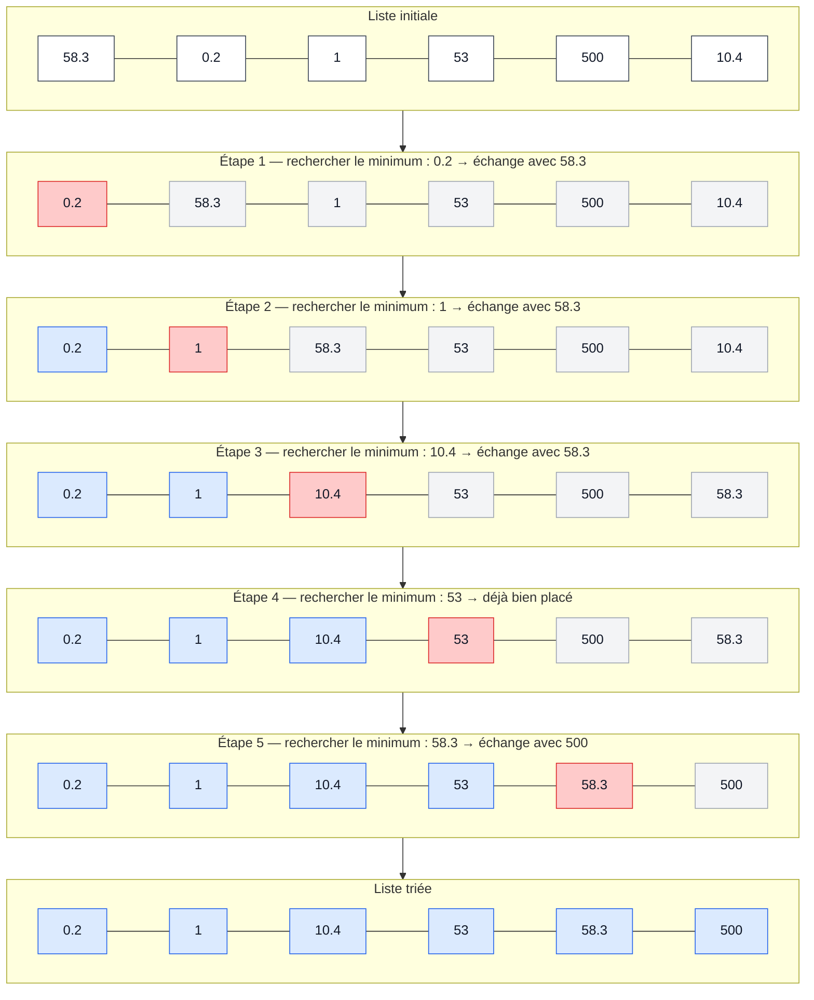
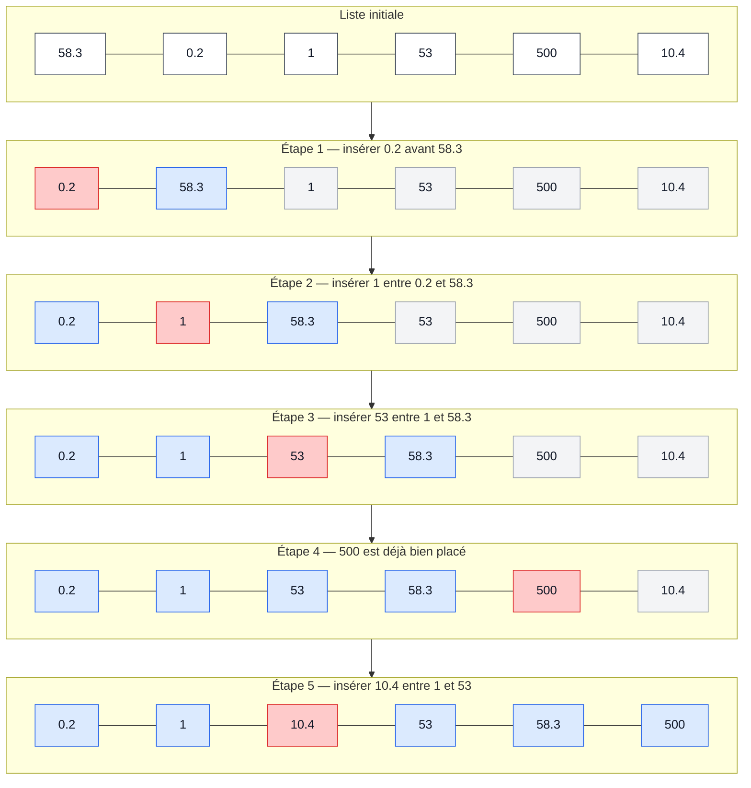

# Informatique S3 — Cours Python

## Sommaire
- [Séquence 1 — Premiers pas en Python](#seq1)
	- [1. Bases](#seq1-1)
		- [1.1 Variable, identifiant et affectation](#seq1-1-1)
		- [1.2 Commentaire](#seq1-1-2)
		- [1.3 Entrée/Sortie](#seq1-1-3)
	- [2. Types et opérations](#seq1-2)
		- [2.1 Nombres](#seq1-2-1)
		- [2.2 Booléens](#seq1-2-2)
		- [2.3 Chaînes de caractères, conversion de type et f-strings](#seq1-2-3)
	- [3. Débogage](#seq1-3)
		- [3.1 Réflexes](#seq1-3-1)
		- [3.2 Erreurs courantes](#seq1-3-2)
- [Séquence 2 — Logique, tests conditionnels et boucles](#seq2)
	- [1. Logique](#seq2-1)
		- [1.1 Conditions logiques](#seq2-1-1)
		- [1.2 Opérateurs logiques](#seq2-1-2)
	- [2. Tests conditionnels](#seq2-2)
		- [2.1 Instruction if](#seq2-2-1)
		- [2.2 Instruction if-else](#seq2-2-2)
		- [2.3 Instruction if-elif-else](#seq2-2-3)
		- [2.4 Instruction match-case](#seq2-2-4)
	- [3. Boucles](#seq2-3)
		- [3.1 Boucle for](#seq2-3-1)
		- [3.2 Boucle while](#seq2-3-2)
- [Séquence 3 — Listes](#seq3)
	- [1. Création d'une liste](#seq3-1)
		- [1.1 Parcours d'une liste](#seq3-1-1)
		- [1.2 Opérations sur les listes](#seq3-1-2)
		- [1.3 Modification de listes](#seq3-1-3)
		- [1.4 Sous-listes et listes de listes](#seq3-1-4)
	- [2. Algorithmes de recherche](#seq3-2)
		- [2.1 Recherche d'éléments](#seq3-2-1)
		- [2.2 Recherche min-max](#seq3-2-2)
	- [3. Algorithmes de tri](#seq3-3)
		- [3.1 Tri par sélection](#seq3-3-1)
		- [3.2 Tri par insertion](#seq3-3-2)
		- [3.3 Tri à bulles (Ajout personnel)](#seq3-3-3)
- [Séquence 4 - Fonctions et algorithmique](#seq4)
	- [1. Ecriture de fonctions](#seq4-1)
		- [1.1 Définition et syntaxe](#seq4-1-1)
		- [1.2 Paramètres et renvois](#seq4-1-2)
		- [1.3 Documentation](#seq4-1-3)
		- [1.4 Bibliothèques](#seq4-1-4)


<a id="seq1"></a>
# Séquence 1 — Premiers pas en Python
<a id="seq1-1"></a>
## 1. Bases
<a id="seq1-1-1"></a>
### 1.1 Variable, identifiant et affectation
**Définition :** Une **variable** est l'association d'un **identifiant** à un objet stocké en mémoire.
Cette opération d'association est appelée **affectation** (`=`).
Exemple : `a = 1` et `b = 2`.

> **Attention :**
> 1. (`=`) n'est pas symétrique : `1 = a` est impossible.
> 2. L'opérateur `=` permet également la mise à jour d'une variable.
            
**Exercice :** Attribuer une valeur à la variable `a` et une autre à la variable `b`.
```python
a = 1
b = 2
```
Pour échanger deux variables, on peut faire :
```python
c = a
a = b
b = c
```

> **Remarque :**
> 1. Bien choisir l'identifiant des variables (`s`, `somme`, etc.).
> 2. Un identifiant doit respecter certaines règles : il ne peut pas contenir certains caractères (`@`, `#`, etc.) et ne peut pas commencer par un nombre.
          
<a id="seq1-1-2"></a>  
### 1.2 Commentaire
En Python, on utilise `#` pour écrire un commentaire sur une ligne.
Un commentaire peut également être placé après du code sur la même ligne.
On peut aussi utiliser `"""` pour une chaîne de caractères multilignes. On peut parfois l'utiliser comme un commentaire, mais ce n'est pas techniquement un commentaire.

**Exemple :**
```python
# commentaire d'une ligne
a = 1  # commentaire après du code
"""
Chaîne de caractères
sur plusieurs lignes
"""
```

<a id="seq1-1-3"></a>
### 1.3 Entrée/Sortie
Affichage : `print()`

Multi-affichage:
```python
a = 1
b = 2
c = 3
print(a, b, c)
# RETOURNE : 1 2 3
```

Affichage de chaîne de caractères : `print("Hello World!")`

Saisie utilisateur : `input()`

> **Attention :** `input()` renvoie **toujours** une chaîne de caractères.

Exemple :
```python
name = input("Quel est votre nom ? ")
print(name)
```
<a id="seq1-2"></a>
## 2. Types et opérations
**Définition :** En Python, chaque objet possède un **type**. Il indique la nature de l'objet manipulé et les **opérations** que l'on peut lui appliquer.

Fonction `type()`:
```python
print(type("Hello World"))
# RETOURNE : str
```

<a id="seq1-2-1"></a>
### 2.1 Nombres

- `int`: entier relatif
- `float`: nombres décimaux
- `complex`: nombre complexe, avec `j` pour représenter la partie imaginaire (identique au i en maths)

Exemple :
```python
z= 3+4j
print(z.real, z.imag)
```

Opérations arithmétiques:
| Opérateur | Signification                             |
| --------- | ----------------------------------------- |
| `+`       | addition                                  |
| `-`       | soustraction                              |
| `*`       | multiplication                            |
| `**`      | puissance                                 |
| `/`       | division                                  |
| `//`      | division euclidienne                      |
| `%`       | modulo (reste de la division euclidienne) |


**Exercice :**
```python
a, b = 21, 5
a/b # 4.2 en float
a//b # 4 en int
a%b # 1 en int
```

**Opérations d'affectation :**
incrémentation, décrémentation
```python
a += 1
b -= 2
```

**Exercice :** Bob a 4 notes : 10, 15, 13 et 8. Calculer sa moyenne.
```python
moy = 10
moy += 15
moy += 13
moy += 8
moy /= 4
print(moy)
# RETOURNE : 11.5
```
<a id="seq1-2-2"></a>
### 2.2 Booléens
`bool` -> `True`, `False`

Opérations de comparaisons:
| Opérateur | Signification       |
| --------- | ------------------- |
| `==`      | égal à              |
| `<`       | inférieur à         |
| `>`       | supérieur à         |
| `<=`      | inférieur ou égal à |
| `>=`      | supérieur ou égal à |
| `!=`      | différent de        |


**Exercice :**
```python
a, b = True, False
a == b  # False
a != b  # True
```
<a id="seq1-2-3"></a>
### 2.3 Chaînes de caractères, conversion de type et f-strings
- Type d'une chaîne de caractères: `str`
- Concaténation: assemblage de deux chaînes de caractères avec `+`

Exemple :
```python
txt1="Hello"
space=" "
txt2="World"
print(txt1+space+txt2)
```
La concaténation fonctionne également avec `+=`

**Exemple personnel :**
```python
txt = "Hello"
txt += " World"
```

Conversion de type : convertit une valeur dans le type souhaité.
| Fonction | Type |
| :- | :- |
| `int()` | Entier |
| `float()` | Nombre réel |
| `complex()` | Nombre complexe |
| `bool()` | Booléen |
| `str()` | Chaîne de caractères |

Exemple :
```python
age = 20
print("J'ai "+str(age)+" ans")
```
```python
age = 20.0
print(f"J'ai {age:.0f} ans")
# RETOURNE : J'ai 20 ans
```

**Exercice :**
```python
p = float(input("Ton poids (kg)? "))
t = float(input("Ta taille (m)? "))
print(f"Ton imc est: {p/(t**2)}")
```

<a id="seq1-3"></a>
## 3. Débogage
<a id="seq1-3-1"></a>
### 3.1 Réflexes
- Lire l'erreur et essayer de la comprendre.
- Vérifier la syntaxe du code.
- Utiliser `help()`. [Par exemple `help(print)` renvoie la documentation sur la fonction `print()`]
- Rechercher sur Google votre message d'erreur.

<a id="seq1-3-2"></a>
### 3.2 Erreurs courantes
- `SyntaxError`: apparaît quand le code est mal écrit: oubli de parenthèse, de tabulation, de frappe dans le code (print("Hello Wolrd") n'est pas une erreur), ...
- `NameError`: apparaît par exemple quand une variable n'est pas définie, ...

<a id="seq2"></a>
# Séquence 2 — Logique, tests conditionnels et boucles
<a id="seq2-1"></a>
## 1. Logique
<a id="seq2-1-1"></a>
### 1.1 Conditions logiques
```python
cond_1 = 5**2 < 2**5
cond_2 = 36 ==89
print(cond_1, cond_2)
# RETOURNE : True False
```
**Exercice :** Demander l'année de naissance de l'utilisateur et déterminer s'il est majeur (`True`) ou non (`False`).
```python
a=int(input("Année de naissance: "))
calc=2026-a #Pour l'année 2026
cond=calc>=18
print(f"Majeur? {cond}")
```
<a id="seq2-1-2"></a>
### 1.2 Opérateurs logiques
| Opérateur | Signification | Exemple   |
| --------- | ------------- | --------- |
| `and`     | ET            | `p and q` |
| `or`      | OU            | `p or q`  |
| `not`     | NON           | `not p`   |

```python
cond=(56>8)and(6!=9)
print(cond)
# RETOURNE : True
```

**Exercice :** Donner la génération de la personne en fonction de son année de naissance.
```python
a=int(input("Année de naissance: "))
cond1=a>=1965 and a<=1980
cond2=a>=1981 and a<=1996
cond3=a>=1997 and a<=2010
print(f"genX? {cond1}\ngenY? {cond2}\ngenZ? {cond3}")
```

<a id="seq2-2"></a>
## 2. Tests conditionnels
> **Remarque :**
> - Le séparateur `:` est placé après la condition.
> - L'indentation indique les actions à effectuer lorsque la condition est vérifiée.

<a id="seq2-2-1"></a>
### 2.1 Instruction if
```python
if condition:
    instructions
```

**Exercice :** Re-test de majorité
```python
age=2026-int(input("Année de naissance: "))
if age<18:
    print("Mineur")
if age>=18:
    print("Majeur")
```
<a id="seq2-2-2"></a>
### 2.2 Instruction if-else
```python
if condition:
    action_1
else:
    action_2
```
 
**Exercice :** paire ou impaire
```python
number=int(input("Choisir un nombre: "))
if number%2==0:
    print(f"Le nombre {number} est pair")
else:
    print(f"Le nombre {number} est impair")
```
<a id="seq2-2-3"></a>
### 2.3 Instruction if-elif-else
```python
if condition:
    action_1
elif condition_2:
    action_2
# ... autant de blocs elif que nécessaire
else:
    action_n
```

**Exercice :** Test de divisibilité de 2 à 7 d'un nombre entier choisi par l'utilisateur
```python
nombre=int(input("Choisir un nombre entier: "))
if nombre%2==0:
    print(f"{nombre} est divisible par 2")
elif nombre%3==0:
    print(f"{nombre} est divisible par 3")
elif nombre%5==0:
    print(f"{nombre} est divisible par 5")
elif nombre%7==0:
    print(f"{nombre} est divisible par 7")
else:
    print(f"{nombre} n'est pas divisible par 2, 3, 5, 7")
```
> **Note personnelle :** si on choisit `6` on remarque que le programme affiche uniquement que `6 est divisible par 2` et non par 3. En effet quand le programme trouve une condition qui est vérifiée, il ne vérifie pas les autres. Autrement dit pour 6 il s'arrête à divisible par 2. Pour cela il faudrait utiliser des `if` a la place des `elif` pour vérifier chaque condition. Il faudrait aussi remplacer/supprimer le `else` car il se trouverait à la fin de la dernière boucle.

<a id="seq2-2-4"></a>
### 2.4 Instruction match-case
Similaire à `if`-`elif`-`else`. Dès qu'un `case` correspond, les autres `case` ne sont pas évalués.
```python
match element:
    case valeur_1:
        action_1
    case valeur_2:
        action_2
    # ... autant de blocs case que nécessaire 
```

Exemple :
```python
x=2
match x:
    case 1:
        print("x vaut 1")
    case 2:
        print("x vaut 2")
# RETOURNE : x vaut 2
```
Pour tester des conditions avec des opérateurs de comparaison, la syntaxe change légèrement et il faut utiliser un `if`.
```python
case x if x < 2:
```
On peut aussi utiliser `case _:` qui agit un peu comme le `else` (Ajout personnel)


**Exercice :** Programme qui demande quelle opération est associée au symbole `**` en Python.
```python
print("Dans le langage Python, quelle opération est associée au symbole **?\nA. division\nB. multiplication\nC. puissance\nD. division euclidienne\n")
rep=input("Saisir la lettre de votre réponse: ")
match rep:
    case "A":
        print("FAUX")
    case "B":
        print("FAUX")
    case "C":
        print("TU AS TROUVÉ LA BONNE REPONSE")
    case "D":
        print("FAUX")
```

<a id="seq2-3"></a>
## 3. Boucles
- `for`: parcourt les éléments d'un itérable.
- `while`: répète des instructions tant qu'une condition est vraie.

<a id="seq2-3-1"></a>
### 3.1 Boucle `for`
```python
for element in iterable:
    Instruction
```

Exemple :
```python
for i in range(4):
    print(i)
```
- `range(n)`: entier de 0 à n-1
- `range(m, n)`: entier de m à n-1
- `range(m, n, p)`: on va de l'entier `m` à n-1 avec un pas de `p` (Ajout personnel)

**Exercices :** Calculer la somme: $\sum_{k=1}^{2026} \frac{k}{2}$ et le produit: $\prod_{k=1}^{20} k^2$
```python
somme=0
for i in range(1,2027):
    somme+=(i/2)
print(somme)
# RETOURNE : 1026675.5
```
```python
prod=1
for i in range(1,21):
    prod*=i**2
print(prod)
# RETOURNE : 5919012181389927685417441689600000000
```


On peut également parcourir directement une liste grâce aux boucles `for` :
```python
for i in [1,2,3]:
    print(i)
# RETOURNE :
# 1
# 2
# 3
```
```python
for c in "hello":
    print(c)
# RETOURNE :
# h
# e
# l
# l
# o
```
Ajout personnel: on peut aussi parcourir deux listes (ou plus) à la fois avec `zip`:
```python
for i, j in zip(liste1, liste2):
``` 
<a id="seq2-3-2"></a>
### 3.2 Boucle while
```python
while condition:
    instruction
```

Exemple :
```python
i=0
while i < 4:
    print(i)
    i += 1
``` 
> **Attention :** il faut veiller à ce que la condition finisse par devenir fausse afin d'éviter une boucle infinie. (Ajout personnel)
> `break` permet de quitter une boucle. (Ajout personnel)

**Exercice :** Calcul du PGCD
```python
dividende=int(input("Saisir un dividende: "))
diviseur=int(input("Saisir un diviseur: "))
a=dividende
b=diviseur
r=dividende
while r != 0:
    r = a % b
    a = b
    b = r

print(f"{a} est le PGCD")
```

<a id="seq3"></a>
# Séquence 3 — Listes
<a id="seq3-1"></a>
## 1. Création d'une liste
```python
L=[1,2,3,4]
print(L)
# RETOURNE : [1,2,3,4]
```
ou
```python
L=["Hello",25,True,0]
```

Les listes possèdent leur propre type : `list`.
La fonction de conversion associée est `list()`.
```python
L=list("Hello")
print(L)
# RETOURNE : ['H', 'e', 'l', 'l', 'o']
```

```python
print(list(range(5)))
# RETOURNE : [0,1,2,3,4]
```

Compréhension de liste (Écriture par compression dans le cours)
```python
L=[i for i in range(5)]
print(L)
```
Une compréhension de liste permet de créer une liste à partir d'un itérable. 

**Génération de nombres aléatoires :**
En Python, on utilise la librairie `random`
Pour utiliser le module `random` :
```python
import random
```
`random.randint(m, n)` renvoie un entier aléatoire compris entre `m` et `n`, bornes incluses.

**Exercice :** Générer et afficher une liste de 20 entiers aléatoires compris entre 0 et 10.
```python
import random
liste=[random.randint(0,10) for i in range(20)]
print(liste)
```
*Correction personnelle avec des notions non vues en cours :*
```python
import random
liste=[]
for i in range(20):
    liste.append(random.randint(0,10))
print(liste)
```
<a id="seq3-1-1"></a>
### 1.1 Parcours d'une liste
Taille d'une liste : `len()`

Pour la liste `[12, 32, 76, 98, 15]` :

- `12` → indice `0`
- `32` → indice `1`
- `76` → indice `2`
- `98` → indice `3`
- `15` → indice `4`

Mais il est également possible d'utiliser des indices négatifs :

- `15` → indice `-1`
- `98` → indice `-2`
- `76` → indice `-3`
- `32` → indice `-4`
- `12` → indice `-5`

`L[i]` permet d'accéder à l'élément d'indice `i` de la liste `L`.

```python
L=[12,32,76,98,15]
print(L[1],L[-4])
# RETOURNE : 32, 32
```

> **Attention :**
> 1. Un élément ≠ un indice.
> 2. L'indexation croissante va de `0` à `len(L) - 1`.

**Exercice :** Demander à l'utilisateur un nombre, créer une liste allant de `0` à ce nombre, puis calculer la somme de tous les éléments de la liste.
```python
nombre=int(input("Choisir un nombre "))
liste=[]

# Ma version
"""for i in range (nombre):
    liste.append(i)
"""
#Version avec les éléments vus en cours
liste=[i for i in range(nombre)]

somme=0
for i in range (len(liste)):
    somme+=liste[i]

print(f"La somme de 0 à {nombre} est: {somme}")
```
<a id="seq3-1-2"></a>
### 1.2 Opérations sur les listes
Concaténation : `+`
```python
L1=[1, 2, 3]
L2=[1, 5, 6]
print(L1+L2)
# RETOURNE : [1,2,3,1,5,6]
```
La concaténation permet d'assembler deux listes.

Répétition d'une liste : `*`
```python
print([1]*20)
# RETOURNE : [1, 1, 1, 1, 1, 1, 1, 1, 1, 1, 1, 1, 1, 1, 1, 1, 1, 1, 1, 1]
```

Comparaison : `==`
`L1 == L2` renvoie `True` si les deux listes sont égales, sinon `False`.
*Deux listes sont égales si elles contiennent les mêmes éléments dans le même ordre.*

Copie : `L.copy()`

Exemple :
```python
L=[1, 2, 3]
M1=L
M2=L.copy()
L[0]=100
print(M1,M2)
# RETOURNE : [100, 2, 3] [1, 2, 3]
```
> - `M1 = L` : `M1` et `L` désignent la même liste.
> - `M2 = L.copy()` : `M2` est une copie de `L`.
> Ainsi, modifier `L` ultérieurement modifie également `M1`, mais pas `M2`.

**Exercice :** Afficher les 20 premiers termes de la suite de Fibonacci, de $F_0$ à $F_{19}$, sachant que la suite est définie par $F_n = F_{n-1} + F_{n-2}, n \in \mathbb{N}^* \setminus \lbrace 1 \rbrace$, avec $F_0 = 0$ et $F_1 = 1$.
```python
liste=[0,1]

#Ma version
"""
for i in range(2,20):
    liste.append(liste[i-1]+liste[i-2])
"""
#Version utilisant uniquement les notions vues en cours :
for n in range(18):
    liste=liste+[liste[n+1]+liste[n]]

print(liste)
# RETOURNE : [0, 1, 1, 2, 3, 5, 8, 13, 21, 34, 55, 89, 144, 233, 377, 610, 987, 1597, 2584, 4181]
```
<a id="seq3-1-3"></a>
### 1.3 Modification de listes
La modification d'un élément se fait en utilisant son indice.
```python
L=["h","e","l","l","o"]
L[1]="a"
print(L)
# RETOURNE : ['h', 'a', 'l', 'l', 'o']
```

Ajout d'éléments :
- `append(élément)` : ajoute un élément à la fin de la liste.
- `insert(indice, élément)` : ajoute un élément à l'indice indiqué.

Exemple :
```python
L=["h","e","l","l","o"]
L.append("!")
L.insert(2,"e")
print(L)
# RETOURNE : ['h', 'e', 'e', 'l', 'l', 'o', '!']
```

**Exercice :** Testeur de palindrome
```python
mot=input("Saisir un mot en minuscule: ")
# On pourrait utiliser .lower pour mettre le texte dans la même casse.
listeMot = []
for i in mot:
    listeMot.append(i) # Transformation du mot en une liste avec chaque caractère indépendant
palindrome = True

for j in range(len(mot)//2):
    if listeMot[j] != listeMot[-(j+1)]: # Comparaison des caractères : 1er avec le dernier, 2e avec l'avant-dernier, ... avec la méthode des indices croissants et décroissants
        palindrome=False
        # On pourrait rajouter un break pour sortir immédiatement de la boucle quand on sait que ce n'est pas un palindrome.

if palindrome == True:
    print(f"Le mot {mot} est un palindrome.")
else:
    print(f"Le mot {mot} n'est pas un palindrome.")
```

> **Éléments supplémentaires :**
> ```python
> L = [1, 2, 3]
> sum(L)
> # RETOURNE : 6
> ```
> ```python
> list(range(0, 21, 2))
> # RETOURNE : [0, 2, 4, 6, 8, 10, 12, 14, 16, 18, 20]
> ```
>

**Enlever un élément d'une liste :**
- `pop(indice)` : supprime et renvoie l'élément situé à l'indice indiqué (par défaut, le dernier élément).
- `remove(élément)` : supprime la première occurrence de l'élément indiqué dans la liste.

Exemple :
```python
L=["h","e","l","l","o"]
L.pop(2)
print(L)
# RETOURNE : ['h', 'e', 'l', 'o']
```
```python
L=["h","e","l","l","o"]
L.remove("l")
print(L)
# RETOURNE : ['h', 'e', 'l', 'o']
```

**Exercice :** Créer une liste de 1 à 100 et appliquer le crible d'Ératosthène pour enlever les éléments non premiers.
```python
liste=[]
for i in range (2,101):
    liste.append(i)
# Ou: Liste = [i for i in range(2, 101)]

i = 0
while i < len(liste):
    p = liste[i]
    
    # On s'arrête si le nombre testé dépasse la racine carrée de 100 (10)
    if p > 10:
        break
        
    j = i + 1
    while j < len(liste):
        # Si un nombre plus grand est un multiple de p, on le supprime
        if liste[j] % p == 0:
            liste.pop(j)
        else:
            j += 1
    i += 1

print(liste)
# RETOURNE : [2, 3, 5, 7, 11, 13, 17, 19, 23, 29, 31, 37, 41, 43, 47, 53, 59, 61, 67, 71, 73, 79, 83, 89, 97]
```

<a id="seq3-1-4"></a>
### 1.4 Sous-listes et listes de listes

A. **Sous-liste :**
- `L[i: j]`: extrait une sous-liste de `L` entre l'indice `i` et `j-1`
- `L[:j]`: extrait une sous-liste de `L` entre l'indice 0 et `j-1`
- `L[i:]`: extrait une sous-liste de `L` entre l'indice i et `len(L)-1`

Exemple :
```python
L = [4, 6, 7, 3, 1, 8]
print(L[2:5])
# RETOURNE : [7, 3, 1]
```
```python
L = [4, 6, 7, 3, 1, 8]
print(L[:5])
# RETOURNE : [4, 6, 7, 3, 1]
```
```python
L = [4, 6, 7, 3, 1, 8]
print(L[2:])
# RETOURNE : [7, 3, 1, 8]
```
```python
L = [4, 6, 7, 3, 1, 8]
print(L[:])
# RETOURNE : [4, 6, 7, 3, 1, 8]
```

B. **Liste de liste :**
```python
L = [1, 2, [1, 2]]
print(L[2])
# RETOURNE : [1, 2]
```
Pour une matrice A :

$$
A =
\begin{pmatrix}
1 & 2 & 3 \\
4 & 5 & 6 \\
7 & 8 & 9
\end{pmatrix}
$$

On écrit souvent:
```python
A=[[1,2,3],
   [4,5,6],
   [7,8,9]]
```
**Exercice :** Écrire un programme qui permet de calculer un produit matriciel.
```python
m1=int(input("Saisir la dimension m de la matrice A: "))
n1=int(input("Saisir la dimension n de la matrice A: "))
m2=int(input("Saisir la dimension m de la matrice B: "))
n2=int(input("Saisir la dimension n de la matrice B: "))

if n1!=m2:
    print("Le produit de vos matrices est impossible")
else:
    matrice1=[]
    matrice2=[]
    matrice3=[]

    for i in range(m1):
        ligne=[]
        for j in range(n1):
            ligne.append(int(input(f"Saisir le terme {i+1},{j+1} de la matrice A: ")))
        matrice1.append(ligne)

    print(f"\nVotre matrice A est : {matrice1}\n")

    for i in range(m2):
        ligne=[]
        for j in range(n2):
            ligne.append(int(input(f"Saisir le terme {i+1},{j+1} de la matrice B: ")))
        matrice2.append(ligne)

    print(f"\nVotre matrice B est : {matrice2}\n")

    for i in range(m1): # Parcourt les lignes de la matrice A (on descend d'une ligne)
        ligne=[]
        for j in range(n2): # Parcourt les colonnes de la matrice B (on avance horizontalement)
            calcule=0
            for k in range(n1): # Parcourt les cases de la ligne de A et de la colonne de B
                calcule+=matrice1[i][k]*matrice2[k][j]
            ligne.append(calcule)
        matrice3.append(ligne)

    print(f"\nLe produit de {matrice1} par {matrice2} donne \n{matrice3}")
```
> **Explication :** `i` permet de choisir la ligne de la matrice résultat, `j` la colonne de la matrice résultat et `k` permet de faire le calcul à cette position.
>
> Exemple, pour une matrice `2×2`:
> Pour la position `[0][0]`: `matrice1[0][0] * matrice2[0][0] + matrice1[0][1] * matrice2[1][0]`
>
> Pour la position `[0][1]`: `matrice1[0][0] * matrice2[0][1] + matrice1[0][1] * matrice2[1][1]`
>
> Pour la position `[1][0]`: `matrice1[1][0] * matrice2[0][0] + matrice1[1][1] * matrice2[1][0]`
>
> Et pour la position `[1][1]`: `matrice1[1][0] * matrice2[0][1] + matrice1[1][1] * matrice2[1][1]`
>
> Les positions sont définies par `[i][j]`. Dans les calculs, on utilise `matrice1[i][k] * matrice2[k][j]`, où `k` permet de parcourir les éléments nécessaires au calcul.

<details>
<summary> *Autre version avec une fonction (pas encore vue a ce stade du cours) qui permet de crée les matrices A et B :* </summary>

```python
def matrixcreator(m,n,letter):
    matrice=[]
    for i in range(m):
            ligne=[]
            for j in range(n):
                ligne.append(int(input(f"Saisir le terme {i+1},{j+1} de la matrice {letter}: ")))
            matrice.append(ligne)
    print(f"\nVotre matrice {letter} est : {matrice}\n")
    return(matrice)

m1=int(input("Saisir la dimension m de la matrice A: "))
n1=int(input("Saisir la dimension n de la matrice A: "))
m2=int(input("Saisir la dimension m de la matrice B: "))
n2=int(input("Saisir la dimension n de la matrice B: "))

if n1!=m2:
    print("Le produit de votre matrice est impossible")
else:
    matrice1=matrixcreator(m1,n1,"A")
    matrice2=matrixcreator(m2,n2,"B")
    matrice3=[]

    for i in range(m1): # Parcourt les lignes de la matrice A (on descend d'une ligne)
        ligne=[]
        for j in range(n2): # Parcourt les colonnes de la matrice B (on avance horizontalement)
            calcule=0
            for k in range(n1): # Parcourt les cases de la ligne de A et de la colonne de B
                calcule+=matrice1[i][k]*matrice2[k][j]
            ligne.append(calcule)
        matrice3.append(ligne)

    print(f"\nLe produit de {matrice1} par {matrice2} donne \n{matrice3}")
```

</details>

Exemple d'usage de `print()` avec les listes de listes:
```python
L=[1,2,[3,4]]
print(L[2][0])
# RETOURNE: 3
```
```python
L=[1,2,[3,4]]
print(L[:2])
# RETOURNE: [1, 2]
```
```python
L=[1,2,[3,4]]
print(L[2:])
# RETOURNE : [[3, 4]]
```
<a id="seq3-2"></a>
## 2. Algorithmes de recherche
<a id="seq3-2-1"></a>
### 2.1 Recherche d'éléments
- `in` permet de vérifier si un élément est présent dans une liste.

```python
print(5 in [6,5,4,3,2,1,0])
# RETOURNE : True
```

**Exercice :** Créer une liste aléatoire de 20 éléments entre 1 et 10 et rechercher toutes les occurrences du nombre `5` en stockant leurs indices.
```python
import random
Liste=[]
indice=[]
for i in range(20): Liste.append(random.randint(1,10))

for j in range(len(Liste)):
    if Liste[j]==5:
        indice.append(j)

print(Liste)
print(indice)
```
<a id="seq3-2-2"></a>
### 2.2 Recherche min-max

- `min()` affiche le minimum de la liste
- `max()` affiche le maximum de la liste

```python
L=[0.2,1,5.3,500,104,58,3]
print(min(L), max(L))
# RETOURNE : 0.2 500
```

*Sans ces fonctions :* (Ajout personnel)
```python
maxi=0
L=[0.2,1,5.3,500,104,58,3]
for i in range(len(L)):
    if L[i]>maxi:
        maxi=L[i]

print(maxi)

# RETOURNE : 500
```
```python
L=[21, 50.1, 10.12, 3.9, 31, 5, 2.0, 1.2, 400, 3.2]

mini=L[0] # On dit que par defaut le plus petit terme de la liste est le 1er

for i in range(len(L)):
    if mini>L[i]: # Si un terme de la liste est plus petit que mini actuel, mini prend la valeur trouvée
        mini=L[i]

print(mini)

# RETOURNE : 1.2
```

**Exercice :** Soit la liste `P = [[1, 7], [4, 2], [9, 5], [3, 3], [8, 8]]` des coordonnées $(x,y)$ de points. Rechercher les deux points les plus proches et les afficher ainsi que leur distance. (S'inspirer de l'algorithme de recherche du minimum).
```python
import math
P = [[1, 7], [4, 2], [9, 5], [3, 3], [8, 8]]

dmin=math.sqrt((P[0][0]-P[1][0])**2+(P[0][1]-P[1][1])**2) # Par défaut la distance minimale est entre le 1er et le 2nd point.
# On peut aussi utiliser la puissance 1/2 si on ne connait pas la librairie math (**(1/2))
point1=0
point2=1
print(dmin)
for i in range(len(P)):
    for j in range(i+1,len(P)):
        if dmin>math.sqrt((P[i][0]-P[j][0])**2+(P[i][1]-P[j][1])**2):
            dmin=math.sqrt((P[i][0]-P[j][0])**2+(P[i][1]-P[j][1])**2)
            point1=i
            point2=j

print(f"Les points {P[point1]}(l'indice {point1}) et {P[point2]}(l'indice {point2}) sont les plus proches\nDistance entre les deux: {dmin}")

# RETOURNE : Les points [4, 2](l'indice 1) et [3, 3](l'indice 3) sont les plus proches
# Distance entre les deux: 1.4142135623730951
```
 
<a id="seq3-3"></a>
## 3. Algorithmes de tri

- `sorted()`: trie une liste dans l'ordre croissant sans modifier l'ordre original
- `.sort()`: trie directement la liste originale dans l'ordre croissant
- `reverse=True`: permet de trier dans l'ordre décroissant
Note personnelle : l'ordre croissant est celui de la table ASCII

```python
L=[4,0,12,56.8,22.1,98.12,89,127,12,400]
print(sorted(L))
print(L)
# RETOURNE : [0, 4, 12, 12, 22.1, 56.8, 89, 98.12, 127, 400]
# [4, 0, 12, 56.8, 22.1, 98.12, 89, 127, 12, 400]
```
```python
L=[4,0,12,56.8,22.1,98.12,89,127,12,400]
L.sort()
print(L)
# RETOURNE : [0, 4, 12, 12, 22.1, 56.8, 89, 98.12, 127, 400]
```
```python
L=[4,0,12,56.8,22.1,98.12,89,127,12,400]
print(sorted(L, reverse=True))
print(L)
# RETOURNE : [400, 127, 98.12, 89, 56.8, 22.1, 12, 12, 4, 0]
# [4, 0, 12, 56.8, 22.1, 98.12, 89, 127, 12, 400]
```
```python
L=[4,0,12,56.8,22.1,98.12,89,127,12,400]
L.sort(reverse=True)
print(L)
# RETOURNE : [400, 127, 98.12, 89, 56.8, 22.1, 12, 12, 4, 0]
```

- `.reverse()`: permet d'inverser le sens de la liste

```python
L=[4,0,12,56.8,22.1,98.12,89,127,12,400]
L.reverse()
print(L)
# RETOURNE : [400, 12, 127, 89, 98.12, 22.1, 56.8, 12, 0, 4]
```
<a id="seq3-3-1"></a>
### 3.1 Tri par sélection

**Principe :** On recherche le minimum dans la partie non triée, puis on l'échange avec le premier élément de cette partie.

🔵 Partie déjà triée · 🔴 Minimum sélectionné · ⚪ Partie non triée



Exemple personnel: 
```python
L=[21, 50.1, 10.12, 3.9, 31, 5, 2.0, 1.2, 400, 3.2]

for i in range(len(L)):
    mini=L[i] # Par défaut, le minimum est le premier terme de la sous-liste
    indicemini=i
    for j in range(i,len(L)):
        if L[j]<mini: # Recherche du minimum de la sous-liste
            mini=L[j]
            indicemini=j # Stocke l'indice du minimum
    temp=L[i] # On mémorise la valeur du terme qui va être échangé avec le minimum
    L[i]=mini # Le minimum prend sa position
    L[indicemini]=temp # On remet la valeur à l'ancien indice du minimum

print(L)
# RETOURNE : [1.2, 2.0, 3.2, 3.9, 5, 10.12, 21, 31, 50.1, 400]
```

**Exercice :** Soit la liste: `R = [["Alice", 12], ["Bob", 17], ["Chloé", 9], ["David", 15], ["Emma", 11]]` donnant les notes sous la forme `[nom, note]` obtenue par une classe à un examen. À  l'aide de l'algorithme du tri par sélection, trier la liste `R` dans l'ordre décroissant des notes et afficher le classement.
```python
R = [["Alice", 12], ["Bob", 17], ["Chloé", 9], ["David", 15], ["Emma", 11]]

for i in range(len(R)):
    # Recherche de la note maximal:
    noteMax=0
    for j in range(i,len(R)):
        if noteMax<R[j][1]:
            noteMax=R[j][1]
            indiceMax=j

    if noteMax>R[i][1]:
        R[i],R[indiceMax]=R[indiceMax],R[i]

print(R)
# RETOURNE : [['Bob', 17], ['David', 15], ['Alice', 12], ['Emma', 11], ['Chloé', 9]]
```
*Version pour l'ordre croissant :*
```python
R = [["Alice", 12], ["Bob", 17], ["Chloé", 9], ["David", 15], ["Emma", 11]]

for i in range(len(R)):
    # Recherche de la note minimale:
    noteMin=R[i][1]
    indiceMin=i
    for j in range(i,len(R)):
        if noteMin>R[j][1]:
            noteMin=R[j][1]
            indiceMin=j

    if noteMin<R[i][1]:
        R[i],R[indiceMin]=R[indiceMin],R[i]

print(R)

# RETOURNE : [['Chloé', 9], ['Emma', 11], ['Alice', 12], ['David', 15], ['Bob', 17]]
```

<a id="seq3-3-2"></a>
### 3.2 Tri par insertion

**Principe :** On parcourt les éléments de la liste dans l'ordre. Pour chaque élément, on le compare aux précédents et on le déplace vers la gauche jusqu'à trouver sa bonne position.

🔵 Partie déjà triée · 🔴 Élément à insérer · ⚪ Partie non traitée



Exemple personnel: 
```python
L=[21, 50.1, 10.12, 3.9, 31, 5, 2.0, 1.2, 400, 3.2]

for i in range(len(L)):
    temp=L[i] # On mémorise la valeur que l'on doit déplacer
    j=i-1
    while j>=0 and temp<L[j]:
        L[j+1]=L[j] # On décale les termes vers la droite
        j-=1
    L[j+1]=temp # On insère le terme à sa bonne position

print(L)
# RETOURNE : [1.2, 2.0, 3.2, 3.9, 5, 10.12, 21, 31, 50.1, 400]
```
**Remarque :** On pourrait aussi directement commencer au rang 1.

**Exercice :** Écrire un programme qui demande deux mots à l’utilisateur et affiche s’ils sont des anagrammes ou non.
```python
mot1=input("Saisir le 1er mot : ")
mot2=input("Saisir le 2nd mot : ")

liste1=[i for i in mot1]
liste2=[i for i in mot2]

anagrammes=True
if len(mot1)!=len(mot2):
    print(f"{mot1} et {mot2} ne sont pas des anagrammes")
else:
    # Version un avec sort pour trier
    '''
    liste1.sort()
    liste2.sort()
    for i in range(len(liste1)):
        if liste1[i]!=liste2[i]:
            anagrammes=False
    '''
    # Version avec le tri par insertion
    for i in range(len(liste1)):
        temp=liste1[i]
        j=i-1
        while j>=0 and temp<=liste1[j]:
            liste1[j+1]=liste1[j]
            j-=1
        liste1[j+1]=temp

    for i in range(len(liste2)):
        temp=liste2[i]
        j=i-1
        while j>=0 and temp<=liste2[j]:
            liste2[j+1]=liste2[j]
            j-=1
        liste2[j+1]=temp
    
    if liste1!=liste2:
        anagrammes=True
    '''
    for i in range(len(liste1)):
            if liste1[i]!=liste2[i]:
                anagrammes=False
    '''
    # On aurait aussi pu créer une fonction pour trier les deux listes,
    # cela aurait évité d'écrire deux fois le même code.

if anagrammes:
    print(f"{mot1} et {mot2} sont des anagrammes")
else:
    print(f"{mot1} et {mot2} ne sont pas des anagrammes")
```

<a id="seq3-3-3"></a>
### 3.3 Tri à bulles (Ajout personnel)

**Principe :** On compare deux éléments voisins. S'ils sont dans le mauvais ordre, on les échange. On répète les passages jusqu'à ce que la liste soit triée.

À chaque passage, le plus grand élément de la partie non triée
remonte progressivement vers la droite jusqu'à atteindre sa position définitive.

> **À noter :** le tri à bulles fonctionne correctement, mais il est relativement peu efficace pour de grandes listes. Il effectue beaucoup de comparaisons et d'échanges.

<details>
<summary>Voir le déroulement du tri à bulles</summary>

- 🔴 **Rouge** : les deux éléments actuellement comparés
- 🔵 **Bleu** : éléments définitivement triés
- ⚪ **Gris** : éléments qui ne sont pas actuellement comparés

```mermaid
flowchart TB

classDef normal fill:#ffffff,stroke:#374151,color:#111827;
classDef sorted fill:#dbeafe,stroke:#2563eb,color:#111827;
classDef selected fill:#fecaca,stroke:#dc2626,color:#111827;
classDef unsorted fill:#f3f4f6,stroke:#9ca3af,color:#111827;

subgraph S0["Liste initiale"]
direction LR
s0a["58.3"]:::normal --- s0b["0.2"]:::normal --- s0c["1"]:::normal --- s0d["53"]:::normal --- s0e["500"]:::normal --- s0f["10.4"]:::normal
end

subgraph S1["Comparaison : 58.3 > 0.2 → échange"]
direction LR
s1a["58.3"]:::selected --- s1b["0.2"]:::selected --- s1c["1"]:::unsorted --- s1d["53"]:::unsorted --- s1e["500"]:::unsorted --- s1f["10.4"]:::unsorted
end

subgraph S2["Après l'échange"]
direction LR
s2a["0.2"]:::normal --- s2b["58.3"]:::normal --- s2c["1"]:::unsorted --- s2d["53"]:::unsorted --- s2e["500"]:::unsorted --- s2f["10.4"]:::unsorted
end

subgraph S3["Comparaison : 58.3 > 1 → échange"]
direction LR
s3a["0.2"]:::normal --- s3b["58.3"]:::selected --- s3c["1"]:::selected --- s3d["53"]:::unsorted --- s3e["500"]:::unsorted --- s3f["10.4"]:::unsorted
end

subgraph S4["Après l'échange"]
direction LR
s4a["0.2"]:::normal --- s4b["1"]:::normal --- s4c["58.3"]:::normal --- s4d["53"]:::unsorted --- s4e["500"]:::unsorted --- s4f["10.4"]:::unsorted
end

subgraph S5["Comparaison : 58.3 > 53 → échange"]
direction LR
s5a["0.2"]:::normal --- s5b["1"]:::normal --- s5c["58.3"]:::selected --- s5d["53"]:::selected --- s5e["500"]:::unsorted --- s5f["10.4"]:::unsorted
end

subgraph S6["Après l'échange"]
direction LR
s6a["0.2"]:::normal --- s6b["1"]:::normal --- s6c["53"]:::normal --- s6d["58.3"]:::normal --- s6e["500"]:::unsorted --- s6f["10.4"]:::unsorted
end

subgraph S7["Comparaison : 58.3 < 500 → pas d'échange"]
direction LR
s7a["0.2"]:::normal --- s7b["1"]:::normal --- s7c["53"]:::normal --- s7d["58.3"]:::selected --- s7e["500"]:::selected --- s7f["10.4"]:::unsorted
end

subgraph S8["Comparaison : 500 > 10.4 → échange"]
direction LR
s8a["0.2"]:::normal --- s8b["1"]:::normal --- s8c["53"]:::normal --- s8d["58.3"]:::normal --- s8e["500"]:::selected --- s8f["10.4"]:::selected
end

subgraph S9["Après l'échange : 500 est trié"]
direction LR
s9a["0.2"]:::normal --- s9b["1"]:::normal --- s9c["53"]:::normal --- s9d["58.3"]:::normal --- s9e["10.4"]:::normal --- s9f["500"]:::sorted
end

subgraph S10["Comparaison : 0.2 < 1 → pas d'échange"]
direction LR
s10a["0.2"]:::selected --- s10b["1"]:::selected --- s10c["53"]:::unsorted --- s10d["58.3"]:::unsorted --- s10e["10.4"]:::unsorted --- s10f["500"]:::sorted
end

subgraph S11["Comparaison : 1 < 53 → pas d'échange"]
direction LR
s11a["0.2"]:::normal --- s11b["1"]:::selected --- s11c["53"]:::selected --- s11d["58.3"]:::unsorted --- s11e["10.4"]:::unsorted --- s11f["500"]:::sorted
end

subgraph S12["Comparaison : 53 < 58.3 → pas d'échange"]
direction LR
s12a["0.2"]:::normal --- s12b["1"]:::normal --- s12c["53"]:::selected --- s12d["58.3"]:::selected --- s12e["10.4"]:::unsorted --- s12f["500"]:::sorted
end

subgraph S13["Comparaison : 58.3 > 10.4 → échange"]
direction LR
s13a["0.2"]:::normal --- s13b["1"]:::normal --- s13c["53"]:::normal --- s13d["58.3"]:::selected --- s13e["10.4"]:::selected --- s13f["500"]:::sorted
end

subgraph S14["Après l'échange : 58.3 est trié"]
direction LR
s14a["0.2"]:::normal --- s14b["1"]:::normal --- s14c["53"]:::normal --- s14d["10.4"]:::normal --- s14e["58.3"]:::sorted --- s14f["500"]:::sorted
end

subgraph S15["Comparaison : 0.2 < 1 → pas d'échange"]
direction LR
s15a["0.2"]:::selected --- s15b["1"]:::selected --- s15c["53"]:::unsorted --- s15d["10.4"]:::unsorted --- s15e["58.3"]:::sorted --- s15f["500"]:::sorted
end

subgraph S16["Comparaison : 1 < 53 → pas d'échange"]
direction LR
s16a["0.2"]:::normal --- s16b["1"]:::selected --- s16c["53"]:::selected --- s16d["10.4"]:::unsorted --- s16e["58.3"]:::sorted --- s16f["500"]:::sorted
end

subgraph S17["Comparaison : 53 > 10.4 → échange"]
direction LR
s17a["0.2"]:::normal --- s17b["1"]:::normal --- s17c["53"]:::selected --- s17d["10.4"]:::selected --- s17e["58.3"]:::sorted --- s17f["500"]:::sorted
end

subgraph S18["Après l'échange : 53 est trié"]
direction LR
s18a["0.2"]:::normal --- s18b["1"]:::normal --- s18c["10.4"]:::normal --- s18d["53"]:::sorted --- s18e["58.3"]:::sorted --- s18f["500"]:::sorted
end

subgraph S19["Comparaison : 0.2 < 1 → pas d'échange"]
direction LR
s19a["0.2"]:::selected --- s19b["1"]:::selected --- s19c["10.4"]:::unsorted --- s19d["53"]:::sorted --- s19e["58.3"]:::sorted --- s19f["500"]:::sorted
end

subgraph S20["Comparaison : 1 < 10.4 → pas d'échange"]
direction LR
s20a["0.2"]:::normal --- s20b["1"]:::selected --- s20c["10.4"]:::selected --- s20d["53"]:::sorted --- s20e["58.3"]:::sorted --- s20f["500"]:::sorted
end

subgraph S21["Après le passage : 10.4 est trié"]
direction LR
s21a["0.2"]:::normal --- s21b["1"]:::normal --- s21c["10.4"]:::sorted --- s21d["53"]:::sorted --- s21e["58.3"]:::sorted --- s21f["500"]:::sorted
end

subgraph S22["Comparaison : 0.2 < 1 → pas d'échange"]
direction LR
s22a["0.2"]:::selected --- s22b["1"]:::selected --- s22c["10.4"]:::sorted --- s22d["53"]:::sorted --- s22e["58.3"]:::sorted --- s22f["500"]:::sorted
end

subgraph S23["Après le passage : 0.2 et 1 sont triés"]
direction LR
s23a["0.2"]:::sorted --- s23b["1"]:::sorted --- s23c["10.4"]:::sorted --- s23d["53"]:::sorted --- s23e["58.3"]:::sorted --- s23f["500"]:::sorted
end

subgraph S24["Liste triée"]
direction LR
s24a["0.2"]:::sorted --- s24b["1"]:::sorted --- s24c["10.4"]:::sorted --- s24d["53"]:::sorted --- s24e["58.3"]:::sorted --- s24f["500"]:::sorted
end

S0 --> S1
S1 --> S2
S2 --> S3
S3 --> S4
S4 --> S5
S5 --> S6
S6 --> S7
S7 --> S8
S8 --> S9
S9 --> S10
S10 --> S11
S11 --> S12
S12 --> S13
S13 --> S14
S14 --> S15
S15 --> S16
S16 --> S17
S17 --> S18
S18 --> S19
S19 --> S20
S20 --> S21
S21 --> S22
S22 --> S23
S23 --> S24
```


</details>

Exemple personnel: 
```python
L=[21, 50.1, 10.12, 3.9, 31, 5, 2.0, 1.2, 400, 3.2]

compteur=len(L)
while compteur>1:
    for i in range(1,compteur): # On ne parcourt pas les termes déjà triés
        if L[i]<L[i-1]: # Si deux termes voisins sont dans le mauvais ordre...
            temp=L[i]
            L[i]=L[i-1]
            L[i-1]=temp # ... On échange leur valeur
    compteur-=1

print(L)

# RETOURNE : [1.2, 2.0, 3.2, 3.9, 5, 10.12, 21, 31, 50.1, 400]
```

<a id="seq4"></a>
# Séquence 4 — Fonctions et algorithmique
<a id="seq4-1"></a>
## 1. Ecriture de fonctions
<a id="seq4-1-1"></a>
### 1.1 Définition et syntaxe

On utilise `def` pour crée une fonction
```python
def fonction(parametres):
    instructions
    return resultats
```
```python
r=fonction(parametres)
```
La variable `r` prend en mémoires ce que la fonction `fonction` retourne.

> **Remarque :**
> 1) `return` ≠ `print`
> 2) paramètres ≠ arguments

**Exercice :** Crée un fonction qui retourne: $f(x)=\frac{x^2+2x-4}{\sqrt{x-3}}$
```python
x=int(input("Votre valeur de x: "))
def f (x):
    resultat=(x**2+2*x-4)/((x-3)**(1/2))
    return resultat
print(f(x))
```

Le type d'une fonction est : `function`
On peut donc écrire:
```python
def f(x):
    # instructions
    return
def g(x):
    # instructions
    return
def composition(f,g,x):
    return f(g(x))
```

<a id="seq4-1-2"></a>
### 1.2 Paramètres et renvois

```python
def fonction(p1, ... , pn):
    # instructions
    return r1, ... , rm

a1, ... , am = fonction(p1, ... , pn)
```

> **Remarque :**
> 1) Une fonction peut ne pas avoir de paramètres (`f()`) par exemple `.sort()`,`.copy()`
> 2) Une fonction peut ne rien renvoyer par exemple:
> ```pyton
> def hello():
>     print("Hello World!")
> hello()
>
> # RETOURNE : Hello World!
> # Mais la fonction hello ne retourne rien.
> ```

**Exercice :** Soit $p(x)=ax^2+bx+c , (a,b,c)\in\mathbb{R}^3$ on veut avoir x quand a=-1, b=-2 et c=5 pour $p(x)=0$:
```python
def racines(a,b,c):
    delta=b**2-4*a*c
    if delta>0:
        x1=(-b-delta**(1/2))/2*a
        x2=(-b+delta**(1/2))/2*a
        return x1,x2
    elif delta==0:
        return (-b)/2*a
    else:
        return "Pas de racine réel"
    
print(racines(-1,-2,5))
# RETOURNE : (1.4494897427831779, -3.449489742783178)
```

<a id="seq4-1-3"></a>
### 1.3 Documentation

Il est important d'expliquer ce que fait une fonction. Voilà une manière de le faire :
```python
def fonction(p1, ... , pn):
    """
    fonction: description de ce que la fonction fait.
    ----------------------
    Entrée :
        p1 : info
        ...
        pn : info
    ----------------------
    Sortie : info
        r1 : info
        ...
        rm : info
    """
    return r1, ... , rm
```

<a id="seq4-1-4"></a>
### 1.4 Bibliothèques

Pour utiliser une bibliothèque, il faut d'abord l'importer. Pour cela on utilise: `import` en suivant la syntaxe :
```python
import nomBibliotheque
```
On peut citer comme exemple courant de bibliothèque `random` ou `math` que l'on utilise comme ceci : `import random`, `import math`.

Pour que l'on puisse utiliser les fonctions associer à ces bibliothèques il est important de faire l'import à tout debut du code:
```python
import math
import random
# import ...

# Puis seulement ensuite de reste du code
```

Pour utiliser les fonctions de la bibliothèque importer on utilise la syntaxe suivant :
```python
nomBibliotheque.nomfonction()
```
Qui permet ici d'utiliser la fonction fonction `nomfonction` de la bibliothèque `nomBibliotheque`.

On peut aussi renommer cette bibliothèque pour faciliter son usage dans la suite du code. Ici `nomBibliotheque` en `nouveauNom` :
```python
import nomBibliotheque as nouveauNom
```
Pour l'utiliser on utilise donc le nouveau nom donner a la fonction suivit de la fonction appeler en suivant la syntaxe suivante :
```python
nouveauNom.nomfonction()
```

On peut aussi importer uniquement une fonction d'un bibliothèque.
Ici on importe la fonction `fonctionImporter` de la bibliothèque `nomBibliotheque`:
```python
from nomBibliotheque import fonctionImporter
```
Pour l'utiliser on utilise donc son nom : `fonctionImporter()`

Enfin on peut aussi renommer cette unique fonction importer pour faciliter son usage dans le code :
Ici on importe `fonctionImporter` depuis `nomBibliotheque` et on transforme le nom de la fonction importer en `fct`:
```python
from nomBibliotheque import fonctionImporter
    as fct
```
Pour l'utiliser on utilise donc son nouveau nom : `fct()`.